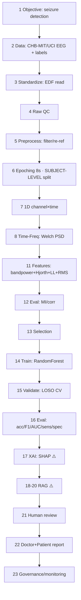

# Architecture — Epilepsy EEG → AI → RAG (23-step flow, §162)

Mapped to the **real code in this repo**. Status (§57.7): ✅ run+committed · 📁 code present, re-run · ⚠️ gap (not in this classical-ML paper).

> This paper is a **classical-ML honest-evaluation** study (RandomForest on engineered
> features, CHB-MIT/UCI). The DL-image, XAI, and RAG steps are documented as the full
> architecture but marked ⚠️ where this specific paper does not implement them.

## Flow diagram

## 23 steps → real epilepsy code
| # | Step | Status | Where in this repo |
|---|---|---|---|
| 1 | Objective | ✅ | README — patient-independent seizure detection |
| 2 | Data collection | ✅ | `data-samples/` (CHB-MIT/Siena 10-row) + real datasets named |
| 3 | Standardize (EDF→arrays) | ✅ | `code/reproducible/chbmit_loso_pipeline.py` (EDF→arrays via `mne`, inline) |
| 4 | Raw QC | 📁 | not included in this repo |
| 5 | Preprocess (bandpass/notch/re-ref/ICA) | ✅ | `code/reproducible/chbmit_loso_pipeline.py` — 0.5–40 Hz Butterworth (inline; no notch/re-ref/ICA) |
| 6 | Epoching + **subject split** | ✅ | 8s epochs, LOSO in `chbmit_loso_pipeline.py` |
| 7 | 1D signal prep | ✅ | channel×time matrix, `chbmit_loso_pipeline.py` |
| 8 | Time-frequency | ✅ | **Welch PSD** (`scipy.signal.welch`) in `chbmit_loso_pipeline.py` |
| 9 | 1D→2D images | ⚠️ | not used (classical features, not CNN-images) |
| 10 | Norm + standardize | ✅ | `code/reproducible/chbmit_loso_pipeline.py` — StandardScaler (train-fold only) |
| 11 | Feature extraction | ✅ | δθαβγ band-power + Hjorth(act/mob/comp) + line-length + RMS (mean+std) |
| 12 | Feature evaluation | ✅ | `code/reproducible/xai_feature_importance.py` (RF importances + SHAP) |
| 13 | Feature selection | 📁 | not applied — full 20-D vector used (see `xai_feature_importance.py` for importances) |
| 14 | Model training | ✅ | `RandomForest(300,balanced)` (⚠️ no DL in this paper) |
| 15 | Validation | ✅ | **LOSO** (24×) + UCI 5-fold |
| 16 | Evaluation | ✅ | `accuracy/*.json`: CHB-MIT 90%/35.1% sens/0.846 AUC; UCI 96.99%/88.4% |
| 17 | Explainable AI | ⚠️ | RF feature-importance available; SHAP not yet wired |
| 18 | RAG index | ⚠️ | not in this paper (see eeg-stress-rag for the RAG reference) |
| 19 | Retrieval | ⚠️ | — |
| 20 | RAG report | ⚠️ | — |
| 21 | Human review | ⚠️ | clinical HITL — out of scope for this methods paper |
| 22 | Doctor/patient report | ⚠️ | — |
| 23 | Governance + monitoring | 📁 | model card `architecture/model_card.md`; honest-eval finding IS the governance signal |

## The invariant this paper proves (step 6/15)
Subject-level (LOSO) is mandatory. Epoch-level evaluation overstated sensitivity by 53
points (88.4% → 35.1%) on the same pipeline — the central honest-evaluation finding.
See `accuracy/README.md`.
