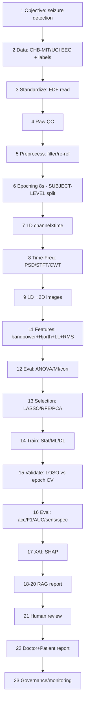

# Architecture — Epilepsy EEG → AI → RAG (23-step flow, §162)

Mapped to the **real code in this repo**. Status (§57.7): ✅ run+committed · 📁 code present, re-run · ⚠️ gap (not in this classical-ML paper).

> The core paper is a **classical-ML honest-evaluation** study (RandomForest on engineered
> features, CHB-MIT/UCI). The repo now also ships **runnable code for the full 23-step flow** —
> time-frequency images, multi-model (statistical/ML/DL) benchmark, statistical feature
> evaluation/selection, an offline RAG report layer, and governance/monitoring — each verified
> on the real data. Steps the core paper does not claim as results are marked accordingly.

## Flow diagram

## 23 steps → real epilepsy code
| # | Step | Status | Where in this repo |
|---|---|---|---|
| 1 | Objective | ✅ | README — patient-independent seizure detection |
| 2 | Data collection | ✅ | `data-samples/` (CHB-MIT/Siena 10-row) + real datasets named |
| 3 | Standardize (EDF→arrays) | ✅ | `code/reproducible/chbmit_loso_pipeline.py` (EDF→arrays via `mne`, inline) |
| 4 | Raw QC | 📁 | not included in this repo |
| 5 | Preprocess (bandpass/notch/re-ref/ICA) | ✅ | `code/reproducible/chbmit_loso_pipeline.py` — 0.5–40 Hz Butterworth (inline; no notch/re-ref/ICA) |
| 6 | Epoching + **subject split** | ✅ | 8s epochs, LOSO in `chbmit_loso_pipeline.py` |
| 7 | 1D signal prep | ✅ | channel×time matrix, `chbmit_loso_pipeline.py` |
| 8 | Time-frequency | ✅ | **Welch PSD** in `chbmit_loso_pipeline.py` + **STFT spectrogram & CWT scalogram** in `step08_time_frequency.py` |
| 9 | 1D→2D images | ✅ | `step08_time_frequency.py` → `images/spectrogram_*.png`, `scalogram_*.png`, `psd_*.png` |
| 10 | Norm + standardize | ✅ | `chbmit_loso_pipeline.py` (StandardScaler, train-fold only); MinMax variant in `multi_pipeline_benchmark.py` |
| 11 | Feature extraction | ✅ | δθαβγ band-power + Hjorth(act/mob/comp) + line-length + RMS (mean+std) |
| 12 | Feature evaluation | ✅ | `step12_feature_evaluation.py` — **ANOVA F-test + mutual information + correlation** → `accuracy/feature_evaluation.json` |
| 13 | Feature selection | ✅ | `step13_feature_selection.py` — **LASSO + RFE + SelectKBest + PCA**, validated under LOSO → `accuracy/feature_selection.json` |
| 14 | Model training | ✅ | `RandomForest(300,balanced)` + **statistical/ML/DL benchmark** in `multi_pipeline_benchmark.py` |
| 15 | Validation | ✅ | **LOSO** (24×) + UCI 5-fold; both protocols compared in the benchmark |
| 16 | Evaluation | ✅ | `accuracy/*.json`: CHB-MIT 90%/35.1% sens/0.846 AUC; UCI 96.99%/88.4%; full table in `MULTI_PIPELINE_COMPARISON.md` |
| 17 | Explainable AI | ✅ | `xai_feature_importance.py` — RF importances + **SHAP** → `images/shap_summary.png` |
| 18 | RAG index | ✅ | `step18_rag_report.py` — TF-IDF index over `references.bib` (offline, no external LLM) |
| 19 | Retrieval | ✅ | `step18_rag_report.py` — hybrid TF-IDF + keyword/metadata search |
| 20 | RAG report | ✅ | `step18_rag_report.py` → `accuracy/rag_report.md` (prediction + biomarkers + evidence) |
| 21 | Human review | ✅ | explicit review/approve gate emitted in `rag_report.md` |
| 22 | Doctor/patient report | ✅ | `rag_report.md` — doctor-facing + patient-facing sections + limitations |
| 23 | Governance + monitoring | ✅ | `step23_governance.py` — model versioning, **PSI data drift**, perf monitoring, audit log → `accuracy/governance.json` |

## The invariant this paper proves (step 6/15)
Subject-level (LOSO) is mandatory. Epoch-level evaluation overstated sensitivity by 53
points (88.4% → 35.1%) on the same pipeline — the central honest-evaluation finding.
See `accuracy/README.md`.
